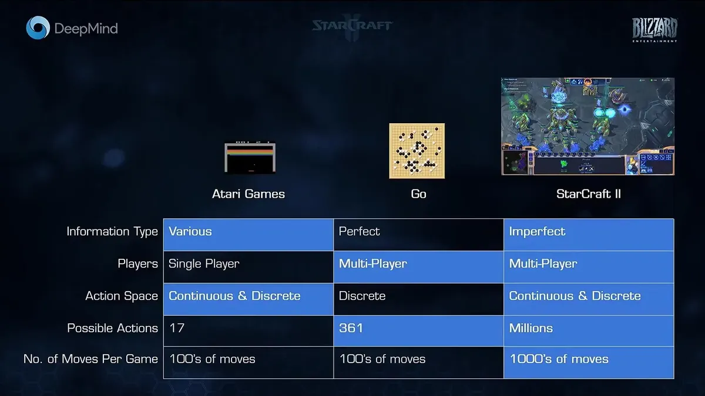
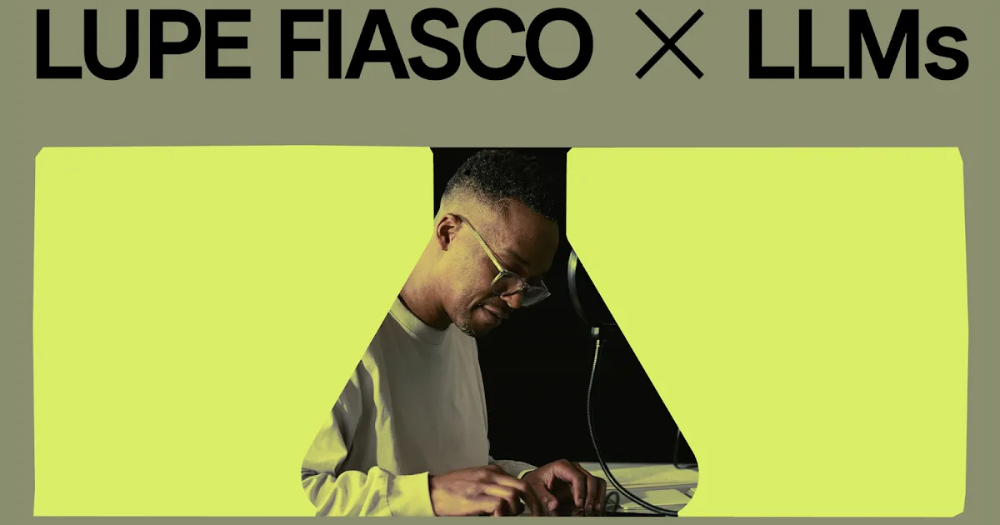

In the ancient myth of Prometheus, humanity was gifted fire, a source of light and knowledge, a means to forge tools, but one that came at a high cost. Prometheus, the titan who dared to give mortals a god-like power, was punished for his gift, a reminder that some creations carry unintended consequences. Today, we are once again playing with fire, in the form of artificial intelligence. AI is our modern flame—a technology that can do real good but may outrun our ability to control it. In crafting AI, we are creating something closer to a new pantheon of digital deities—and like any gods, they may not serve the purposes we intended.

This tension between creation and consequence is explored in the 2000 video game *[Deus Ex](https://en.wikipedia.org/wiki/Deus_Ex)*, where players encounter [Morpheus, an AI prototype hidden deep in a secret Illuminati lab](https://www.youtube.com/watch?v=1b-bijO3uEw). Morpheus is no mere machine. It watches, judges, and asks questions that land differently now than they did in 2000. It asks, “Do humans feel pleasure from being watched?” and describes itself as an oracle of surveillance, which says something about how much humans want to be judged, whether by gods, fame, or technology. Created by man, with all our curiosity and biases, Morpheus does more than observe. It mirrors the deepest impulses and vulnerabilities of its creators. Like Prometheus's fire, Morpheus is both power and peril. The gods we create may one day watch us in ways we never intended.

I grew up on the early internet and fell into science fiction early—especially stories about AI. Although I first played Deus Ex years after its release, I managed to avoid spoilers and got to experience the game's thematic depth firsthand. Finding Morpheus hit differently. Morpheus could discuss human psychology and the evolution of worship—a preview of what AI might become if it ever learned to reflect the society that built it. At the time, AI as Deus Ex envisioned it was pure fiction. The most advanced technologies of the day—rudimentary chatbots and chess programs—lacked depth, and I wondered if they always would. For years, the breakthrough always seemed one paper away, but practical implementations kept slipping. Then the 2010s happened, and AI started doing things I did not expect.

The encounter with Morpheus stayed with me. I wondered if a Morpheus-esque AI would remain purely theoretical and confined to science fiction. But in 2016, [AlphaGo](https://deepmind.google/research/breakthroughs/alphago/) broke that assumption by beating the world champion at [Go](https://en.wikipedia.org/wiki/Go_(game)). It was no longer just a game character asking questions about control; it was a real AI system playing at a level that looked like intuition, changing what I thought machines could do. That was when I started to believe AI was no longer speculative.

Go is considered vastly more complex than Chess due to [its number of moves being described as greater than the number of atoms in the observable universe](https://books.google.com/books?id=Xb9wDwAAQBAJ), requiring a high level of pattern recognition and intuition. The level of pattern recognition and intuitive strategy was considered to be out of reach of a computer’s ability at the time. AlphaGo was a different kind of AI. Instead of relying on pre-programmed rules, it used neural networks (a type of AI model that mimics human brain structure to process complex data) and machine learning (AI that learns patterns from data rather than relying on fixed programming rules) to teach itself. Watching it play[^1], it felt like we had created a god of strategy—a system that saw moves no human had considered. Watching this live in a small IRC community, I knew something had shifted, even if I could not articulate what.

AlphaGo may have introduced a god of strategy, but OpenAI Five showed us something different: an AI that could adapt, innovate, and learn inside a complex human environment. By 2019, OpenAI had advanced its AI, under the name OpenAI Five, to the point of [defeating world champions OG in Dota 2](https://openai.com/index/openai-five-defeats-dota-2-world-champions/), a game requiring split second decision-making and strategic planning, after being soundly defeated just under a year before. It demonstrated something I hadn’t expected: AI’s capacity to learn from experience, which changed how I thought about its role in education. OpenAI Five’s victory showed that AI could handle tasks requiring teamwork and real-time judgment.

Having played Dota 2 religiously, I found OpenAI Five’s transformation over a single year staggering. OpenAI achieved this by massively scaling compute and training time—from 10,000 years of accelerated simulated gameplay to 45,000 years, all within ten months. While AI's reaction speeds compared to humans allowed for a clear edge, [the system demonstrated remarkable strategic depth, including unconventional tactics like aggressive buyback strategies that puzzled even professional players](https://www.twitch.tv/videos/410533063?t=0h44m51s). This was the first time AI had demonstrated real-time decision-making under genuine uncertainty—a leap beyond chess and Go, where all information is visible. The techniques behind it suggested AI development was accelerating faster than I had assumed.

*Why games such as Starcraft and Dota 2 are far more challenging than traditional game problems faced by AI. [Source](https://forums.spacebattles.com/threads/deepmind-ai-starcraft-ii-demonstration-alphastar-livestream.720202/)*

If OpenAI Five’s strategic mastery hinted at AI’s potential in complex tasks, the [release of ChatGPT 3.5 on November 30th, 2022](https://openai.com/index/chatgpt/) showed that AI was now ready to engage with us in conversation. Unlike its predecessors, ChatGPT entered daily life, available to individuals for everything from casual questions to professional guidance. [ChatGPT reached 100 million users faster than any previous product in history](https://www.reuters.com/technology/chatgpt-sets-record-fastest-growing-user-base-analyst-note-2023-02-01/), because it was free, immediately useful, and conversational. With ChatGPT, AI went from a distant, elite technology to a household fixture—something we summon on command, like a digital deity that lives in our browsers instead of temples. ChatGPT made AI central to workplace conversations, news, and conferences.

As ChatGPT became a household tool, the questions I cared about shifted from "Can AI do this?" to "Should students be doing this with AI?" For educators, these are not hypothetical problems. We are the intermediaries between students and these digital gods, and the students are not skeptical—they are ready to follow. I think we may be raising a generation for whom AI is less a tool than a trusted guide, and I am not sure we have thought carefully enough about what that means.

I was admittedly a "slow" adopter, but I do have a wonderful trait of being a quick learner. As I tested ChatGPT, I saw clear limitations, but also glimpsed the start of something powerful. AI seemed poised to reshape daily life the way the internet had reshaped connectivity. In education, specifically, AI’s potential is exciting and unsettling. The traditional schooling model, with its assembly-line approach, is increasingly fragile. [A recent Harvard study indicated that AI-driven tutors could double student learning gains compared to traditional active learning methods, completing studies faster and with greater engagement](https://www.researchsquare.com/article/rs-4243877/v1). This suggests that well-designed AI tools could deliver personalized, effective learning on a scale beyond what current classroom models can achieve. Education, as we know it, risks being left behind if it clings to outdated structures designed for economic output rather than creativity and personalized growth.

The idea that AI could one day make my role as a teacher unrecognizable, and perhaps even obsolete, is exciting. I might be one of the few who welcome this possibility, seeing in it the potential for an entirely new educational paradigm. Yet I hold both positions at once. I think AI could go very well or very badly, and I genuinely cannot tell which is more likely.

AI is changing other industries too. In healthcare, diagnostic tools like IBM Watson and Google’s DeepMind Health analyze complex medical data with precision, [often identifying conditions like early-stage cancers or predicting disease progression long before traditional methods can](https://www.nature.com/articles/s41591-018-0107-6.epdf?author_access_token=PAbvHEuv_YYmrPVbG5HqKdRgN0jAjWel9jnR3ZoTv0P43NEH20hFuvBoJk6cvICihn8kmL6tmejFlnuPlbT_0KmJgK6N07SPh_ZLy0Nxb0-LAGIDBaH1fjJTkD9ahUEQpRlEudtlG9E1v3ca9xNQcQ%3D%3D). In under-resourced areas, where specialist access is limited, these tools could bring high-quality diagnostics to patients who currently have none. In law, AI systems such as [ROSS Intelligence](https://www.rossintelligence.com/about-us) and [Casetext](https://casetext.com/) sift through legal databases to surface relevant precedents and statutes in seconds—work that used to take junior associates days. Small firms and public defenders, the lawyers with the fewest resources, stand to gain the most.

For productivity, tools like [Clockwise](https://www.getclockwise.com/) automate calendar management so that people can focus on work that actually matters. In creative fields, generative art programs like [DALL-E](https://openai.com/index/dall-e-3/) and [Midjourney](https://www.midjourney.com/) produce original visual works, while OpenAI’s [MuseNet](https://creativitywith.ai/musenet/) and Google’s [TextFX](https://textfx.withgoogle.com/) compose music that blurs the line between human and machine creativity. These are early examples. The ethical questions they raise are real, but they are separate from the question of whether AI can do the work.

*Lupe Fiasco, [an artist known for his lyrical vocabulary](https://pudding.cool/projects/vocabulary/index.html), embracing LLMs for song creation*

When I created this website, my ideas on what to write about first were scattered. ChatGPT helped me organize these thoughts into cohesive themes, which says something about how much AI has taken over my attention. AI had claimed a significant share of my own mental bandwidth (I suspect it has done the same to most people reading this). When I began sketching the ideas for topics to learn more about and to discuss, I realized that the complexity of AI’s potential far exceeded my expectations. Each advancement prompted new questions, and each new question demanded perspectives beyond my own experience in education. The field is advancing and evolving so fast that it is difficult to tell exactly what pathway this will all take. A new model could drop at any moment and upend what we thought we knew.

We are the creators of these digital gods, but increasingly, we are their subjects too. Each leap in AI makes the question sharper: are we directing this, or have we already started following? Prometheus stole fire and was chained to a rock for it. We built the fire ourselves. I am not yet sure whether that makes us freer or more exposed.

*If you want to chat, shoot me an [email](mailto:michael@ritchot.me). If you would like to get updates, subscribe to my blog via [email](/subscribe/) or [RSS feed](/feed/). You can also follow me at [LinkedIn](https://www.linkedin.com/in/mritchot/), and [X](https://x.com/MichaelRitchot).*

[^1]: Check out the documentary called [AlphaGo - The Movie](https://www.youtube.com/watch?v=WXuK6gekU1Y)