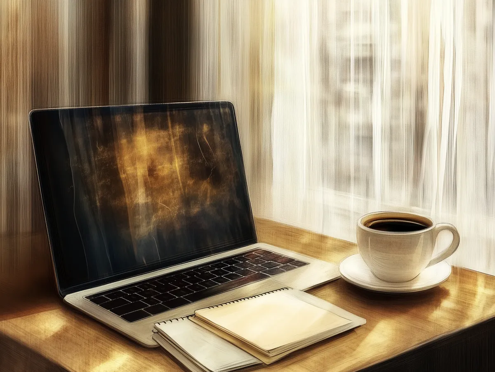

Creating my own website has been on my mind for a while. For years, I kept ideas scribbled in notebooks waiting for that “perfect moment.” But, as the saying goes, *"perfect is the enemy of the good."* So here I am, even if it is far from perfect (or even good — I am rusty).

*Midjourney got my usual screensaver without a prompt, spooky.*

For much of my career, I have been tinkering with technology in schools — building tools that save coworkers time and help institutions hold onto knowledge that would otherwise walk out the door when staff leave. Until now, most of what I made stayed inside whatever school or team I was working with. At some point I stopped being able to justify keeping it all to myself.

I just wanted a platform, a space I control, where I can share openly. Now it’s here.

I do not believe in the present day content treadmill to stay on top of an algorithm. Call me old-fashioned, but I just want to take a slow and steady approach to this site and my writing. I grew up in the 90s watching the internet reshape everything it touched, and I still think technology does more good than harm on balance. Unfortunately, that algorithm treadmill dominating the web has been an evolution I highly dislike. I want this site to feel more like the old web — somewhere I write and share at my own pace, without optimizing for anything except whether the writing was worth the time it took.

For now, I plan to write about whatever holds my attention — sometimes that will be useful material for educators, sometimes it will be whatever I have been thinking about that week. If some of it ends up being useful to someone else, even better.

The part of this I am still excited about is the public accountability. Thinking in public is one of the faster ways to find out where your reasoning breaks. If anyone reads this and pushes back, that is the best possible outcome — it means the writing did enough to be worth disagreeing with.

The hardest part of getting here was my own perfectionism. I kept stalling because nothing felt finished. Every draft had something wrong with it, and “something wrong” was enough to keep it in the drawer. But nothing was going to improve sitting in a notebook. So I am writing in the open instead — putting work out before it feels ready, and seeing what happens when other people can actually respond to it.

*If you want to chat, shoot me an [email](mailto:michael@ritchot.me). If you would like to get updates, subscribe to my blog via [email](/subscribe/) or [RSS feed](/feed/). You can also follow me at [LinkedIn](https://www.linkedin.com/in/mritchot/), and [X](https://x.com/MichaelRitchot).*

I have no idea whether anyone will read this, and I think that might be the point.